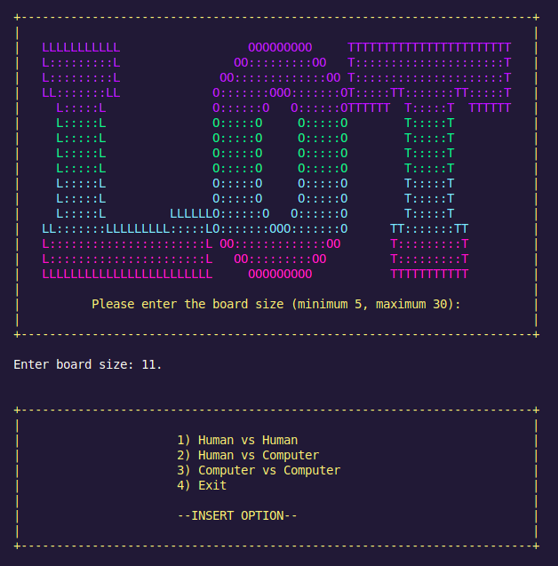
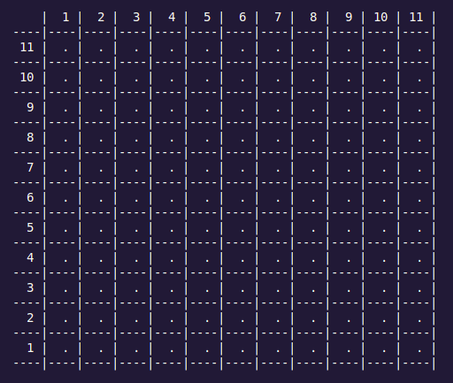

# LOT Game

## Identification
**Game**: Line Of Three (LOT)  
**Group**: LOT_7

**Members**:

| Student Number | Name        | Contribution (%) | Tasks Performed                        |
|----------------|------------------|------------------|----------------------------------------|
| up202208247      | Diana Nunes          | 50%   | Pie Rule Implementation,  Menu System, Game State Control, Move Validation, Basic Line Detection: (Horizontal checking, Vertical checking)                |
| up202206828      | Teresa Mascarenhas          | 50%   | Greedy Algorithm:, Game Interface, AI Strategy, Position Analysis, Advanced Detection:( diagonal checking, stack pattern recognition)                |

## Installation and Execution
### Prerequisites
- **SICStus Prolog 4.9** installed on your system.
- Operating system: Windows or Linux.

### Installation
1. Clone the repository:
   ```bash
   git clone [repository_url]
   cd [repository_folder]
   ```

2. Ensure SICStus Prolog is installed and added to your PATH.

### Execution on Linux
1. Open a terminal and navigate to the game folder:
2. Start SICStus Prolog:
   ```bash
   sicstus
   ```

3. Load the game:
   ```prolog
   consult('game.pl').  
   ['game.pl'].  % alternative solution
   ```

4. Start the game:
   ```prolog
   play.
   ```

### Execution on Windows
1. Open the SICStus Prolog application.
2. Navigate to the game directory in the Prolog console:
3. Load the game (same process as Linux)

## Description of the Game
**Line Of Three (LOT)** is a strategic game played on a 7x7 orthogonal grid. The goal is to create a line of three stacks, each consisting of two pieces. The game is designed for Human vs Human, Human vs AI, and AI vs AI interactions.

### **Rules**

#### **General Rules**
1. **Turn-Based Play**: Players alternate turns, taking one action per turn.
2. **Actions Per Turn**: A player may:
   - Place a piece of their respective colour on an empty cell.
   - check for a Stack Formation.

#### **Stack Formation**
When a **line of three or more pieces (not stacks)** of a player’s color is created in any direction, the following sequence must be executed during the same turn:

1. **Choose a Line**: If multiple lines are created simultaneously, the player must choose one line of three or more pieces.
2. **Remove Two Pieces**: From the chosen line, remove any two pieces, leaving one piece in place.
3. **Create a Stack**: Add a new piece of the player’s color to the single piece left in place,  creating a **stack** of two pieces.
A stack may contain **no more than two pieces** at any given time.

#### **Winning Condition**
- A player wins by forming a **line of three stacks** with two pieces each. Lines can be formed:
  - Horizontally
  - Vertically
  - Diagonally


## Considerations for Game Extensions
- **Variable-sized boards**: The size of the board can be chosen by the user, allowing the game to be adapted to different dimensions by adjusting the initial configurations.
    <p align="center">
        
      </p>
    <p align="center">
        Image 1- Game Menu
      </p>

     <p align="center">
        
      </p>

     <p align="center">
        Image 2- Board of size 11x11
      </p>
- **Optional rules**: Simplified rules for novice players include restricting moves to certain zones. Advanced rules for experts introduce additional win conditions.
- **AI difficulty**: AI algorithms can be extended with enhanced heuristics and depth analysis for expert-level gameplay.

## Game Logic
### Game Configuration Representation
- Initial configuration is represented using a predicate `initial_state/2`. For example:
  `initial_state(Size, state(Board, Player))`
- `Size` is the size of the board, chosen by the user.
- The board is represented as a list of cells, with each cell being either `empty`, `piece(Player)`, or `stack(Player, Height)`.

### Internal Game State Representation
- The game state is maintained using:
  - **Board**: If the board size is the same as the original game, we will have a list of 49 cells for the 7x7 grid. Each cell is defined as:

      - `empty`: No pieces present.
      - `piece(Player)`: A single piece belonging to `Player`.
      - `stack(Player, Height)`: A stack of pieces belonging to `Player`, with `Height` indicating the number of pieces in the stack.
 
#### Initial state
    
   ```prolog
    [[empty, empty, empty, empty, empty, empty, empty],
     [empty, empty, empty, empty, empty, empty, empty],
     [empty, empty, empty, empty, empty, empty, empty],
     [empty, empty, empty, empty, empty, empty, empty],
     [empty, empty, empty, empty, empty, empty, empty],
     [empty, empty, empty, empty, empty, empty, empty],
     [empty, empty, empty, empty, empty, empty, empty]]
     
  
     
         |  1 |  2 |  3 |  4 |  5 |  6 |  7 |
     ----|----|----|----|----|----|----|----|
       7 |  . |  . |  . |  . |  . |  . |  . | 
     ____|____|____|____|____|____|____|____|
       6 |  . |  . |  . |  . |  . |  . |  . | 
     ____|____|____|____|____|____|____|____|
       5 |  . |  . |  . |  . |  . |  . |  . | 
     ____|____|____|____|____|____|____|____|
       4 |  . |  . |  . |  . |  . |  . |  . | 
     ____|____|____|____|____|____|____|____|
       3 |  . |  . |  . |  . |  . |  . |  . | 
     ____|____|____|____|____|____|____|____|
       2 |  . |  . |  . |  . |  . |  . |  . | 
     ____|____|____|____|____|____|____|____|
       1 |  . |  . |  . |  . |  . |  . |  . | 
     ____|____|____|____|____|____|____|____|
   ```
#### Intermediate state

   ```prolog
     [[piece(player1), empty, empty, piece(player1), empty, empty, empty],
       [piece(player2), empty, piece(player2), empty, empty, empty, empty],
       [empty, piece(player2), empty, empty, empty, empty, empty],
       [empty, empty, piece(player1), empty, empty, empty, empty],
       [empty, empty, empty, empty, empty, empty, empty],
       [empty, empty, empty, empty, empty, empty, empty],
       [empty, empty, empty, empty, empty, empty, empty]]
   

     
                 Player *white* Playing
                                          
          |  1 |  2 |  3 |  4 |  5 |  6 |  7 |
      ----|----|----|----|----|----|----|----|
        7 |  ● |  . |  . |  ● |  . |  . |  . | 
      ____|____|____|____|____|____|____|____|
        6 |  ○ |  . |  ○ |  . |  . |  . |  . | 
      ____|____|____|____|____|____|____|____|
        5 |  . |  ○ |  . |  . |  . |  . |  . | 
      ____|____|____|____|____|____|____|____|
        4 |  . |  . |  ● |  . |  . |  . |  . | 
      ____|____|____|____|____|____|____|____|
        3 |  . |  . |  . |  . |  . |  . |  . | 
      ____|____|____|____|____|____|____|____|
        2 |  . |  . |  . |  . |  . |  . |  . | 
      ____|____|____|____|____|____|____|____|
        1 |  . |  . |  . |  . |  . |  . |  . | 
      ____|____|____|____|____|____|____|____|
      
      (0 to exit)
      Enter your move as (Row, Col): |: (4, 1).
      Lines of three found: [[(4,1),(5,2),(6,3)]]
      
      (0 to exit)
      Enter position to stack (e.g., (Rs, Cs)) : |: (5, 2).
      
      Position 5,2 selected for stacking.
      
                 Player *black* Playing
                                          
          |  1 |  2 |  3 |  4 |  5 |  6 |  7 |
      ----|----|----|----|----|----|----|----|
        7 |  ● |  . |  . |  ● |  . |  . |  . | 
      ____|____|____|____|____|____|____|____|
        6 |  ○ |  . |  . |  . |  . |  . |  . | 
      ____|____|____|____|____|____|____|____|
        5 |  . | ○○ |  . |  . |  . |  . |  . | 
      ____|____|____|____|____|____|____|____|
        4 |  . |  . |  ● |  . |  . |  . |  . | 
      ____|____|____|____|____|____|____|____|
        3 |  . |  . |  . |  . |  . |  . |  . | 
      ____|____|____|____|____|____|____|____|
        2 |  . |  . |  . |  . |  . |  . |  . | 
      ____|____|____|____|____|____|____|____|
        1 |  . |  . |  . |  . |  . |  . |  . | 
      ____|____|____|____|____|____|____|____|

   ```

#### Final state

   ```prolog
        [[empty, stack(player2, 2), empty, empty, stack(player1, 2), empty, piece(player1)],
          [empty, empty, stack(player2, 2), empty, stack(player1, 2), empty, empty],
          [empty, stack(player2, 2), stack(player1, 2), empty, empty, empty, empty],
          [stack(player2, 2), empty, empty, empty, empty, empty, empty],
          [empty, empty, empty, empty, empty, empty, empty],
          [empty, empty, empty, empty, empty, empty, empty],
          [empty, empty, empty, empty, empty, empty, empty]]
   

  
                  Player *white* Playing
                                          
          |  1 |  2 |  3 |  4 |  5 |  6 |  7 |
      ----|----|----|----|----|----|----|----|
        7 |  . |  ○ |  . |  . | ●● |  . |  ● | 
      ____|____|____|____|____|____|____|____|
        6 |  . |  . | ○○ |  . | ●● |  . |  . | 
      ____|____|____|____|____|____|____|____|
        5 |  . | ○○ | ●● |  . |  . |  . |  . | 
      ____|____|____|____|____|____|____|____|
        4 | ○○ |  . |  . |  . |  . |  . |  . | 
      ____|____|____|____|____|____|____|____|
        3 |  . |  . |  . |  . |  . |  . |  . | 
      ____|____|____|____|____|____|____|____|
        2 |  . |  . |  . |  . |  . |  . |  . | 
      ____|____|____|____|____|____|____|____|
        1 |  . |  . |  . |  . |  . |  . |  . | 
      ____|____|____|____|____|____|____|____|

      Game over! Winner: white
      true ? yes
   ```
  
     
  - **Turn**: Indicates the current player (`player1` or `player2`).

Example:
```prolog
state([empty, stack(player1, 2), ...], player2).
```

*Final state with a possible line of three.*

### Game state visualization

The game visualization includes helper predicates that manage the game's user interface, focusing on the board display and player interaction.

- The **game state** can be displayed using the **display_game/1** predicate, which outputs the current board to the user in a readable format.

#### Initializing the Game

The game starts with the predicate **initial_state/1**, which sets up the board and assigns the first player randomly.

#### Displaying the Game

The board is displayed with **display_game/1**, which shows the board layout using **print_horizontal_line/1** to print each row and **print_column_headers/1** to show the column headers.

### Move Execution

The **move/3** predicate handles placing a piece:

    move(+GameState, +Move, -NewGameState)

This will validate and apply a move if it's valid.

#### Move Types

There is **one type of move**:
1. **Place a piece**: Adds a new piece to an empty cell.

The **move/3** handles the validation and application of the move. It does it by calling **valid_moves/2**, in order to validate the move and **apply_move/5** in order to apply it.

### Game Over

The game checks for a win condition using the **gameOver/2** predicate:

    game_over(+GameState, -Winner)

The game will end when a player has a line of three pieces stacked in a row (either horizontally, vertically, or diagonally). The predicate checks all possible win conditions on the board.

### List of Valid Moves

To determine the valid moves for a player, the **valid_moves/2** predicate is used:

    valid_moves(+GameState, -Moves)

This predicate will return a list of all valid moves based on the current board state.

### Game State Evaluation

The **value/3**  predicate evaluates the game state from a player's perspective by examining valid moves and their potential outcomes:
     
     value(+GameState, +Player, -Value)
   
The **evaluate_position/4** performs the detailed position analysis, considering three key strategic elements:

    evaluate_position(+GameState, +Row, +Col, -FinalScore)

The evaluation considers:
- Blocking potential opponent lines
- Forming own lines 
- Proximity to opponent pieces

The evaluation helps guide the AI to make optimal decisions.

### Computer Move

The **choose_move/3** predicate allows the computer to decide on its next move:

    choose_move(+GameState, +Level, -Move)

The bot selects a move based on the difficulty level:
- **Easy**: Selects a random move.
- **Hard**: Chooses the best move using a greedy algorithm that evaluates the board.

### Greedy Algorithm Explanation

The greedy algorithm focuses on maximizing immediate advantage while minimizing the opponent's chances of success. Here’s how it operates:

1. **Evaluation Function:** The best_greedy_move/3 uses the evaluation system from value to assign scores to board states. Higher scores favor configurations that:
   
   - Are closer to forming a line of three for the bot.
   - Block the opponent from forming a line of three.

3. **Prioritization:**
   
   - **Blocking:** If the opponent is one move away from completing a line, the algorithm prioritizes moves that block it.
   - **Advancing:** Otherwise, it selects moves that increase the bot's chances of forming a line.

4. **Move Selection:**

   - The bot iterates through all valid moves (generated by valid_moves/2) and simulates the board state after each move.
   - It evaluates each simulated state and chooses the move with the highest score.

This approach ensures the bot remains competitive and strategic, particularly on higher difficulty levels.

## Conclusions
### Summary
This project successfully implements the LOT game, including:
- Human and AI interactions.
- Configurable board and rules.

### Limitations
- The AI can be slow for complex heuristics.
- The current implementation does not support undo functionality.

### Future Improvements
1. Optimize AI performance.
2. Add a graphical user interface (GUI).
3. Support for online multiplayer mode.

## Bibliography
- [SICStus Prolog Documentation](https://sicstus.sics.se/documentation.html)
- [LOT Rules Source](https://boardgamegeek.com/boardgame/127989/lot)
- https://boardgamegeek.com/boardgame/127989/lot
- https://boardgamegeek.com/video/164442/lot/lot-line-of-three-game-overview-and-rules-explanat
- https://boardgamegeek.com/filepage/217760/lot-rules-in-english
- ChatGPT queries for Prolog logic and optimizations.
